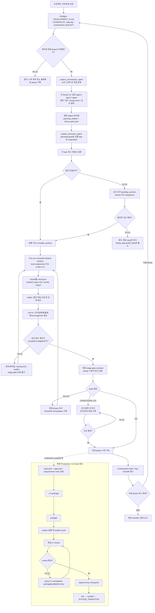

# 프로젝트 오케스트레이션 작업 로직 맵

## 작업 목적

Global GPT Harness Engineering의 프로젝트 오케스트레이션을 문서 계약과 실행 코드 기준으로 한눈에 확인한다. 이 맵은 계획-실행 경계를 보존하면서 세부 작업, 승인 대기, 팬아웃/팬인, Gate, 재개 및 실패 정지를 표현한다.

## 확인 기준

- 문서 계약: `docs/harness/orchestration-execution-standard.md`, `docs/harness/orchestration-approval-rules.md`, `docs/harness/orchestration-runtime-engine.md`
- 기본 실행 코드: `runtime/orchestrator/cli.py`, `runtime/orchestrator/engine.py`
- 작업 분해/위험 분류: `runtime/agents/project_orchestrator_agent.py`, `runtime/agents/project_execution_agent.py`, `runtime/orchestrator/task_router.py`, `runtime/orchestrator/approval_gate.py`
- 수집/합성/Gate: `runtime/orchestrator/result_collector.py`, `runtime/orchestrator/fanin.py`, `runtime/orchestrator/stage_gate.py`

## 상세 흐름

## 단계별 세부 작업과 산출물

| 단계 | 세부 작업 | 주요 코드/산출물 | 통과 조건 |
|---|---|---|---|
| 1. Preflight | 프로젝트 계약·변경 이력·활동 로그·현재 상태 확인 | `contract_loader.py`, `state_store.py` | 현재 phase와 요구 산출물이 식별됨 |
| 2. 계획 | 개발계획의 섹션을 키워드로 라우팅하고 담당 agent를 배정 | `project_orchestrator_agent.py`, `task_router.py` | thread plan이 1개 이상 생성되고 실행 가능 상태임 |
| 3. 실행 materialize | persisted planning artifact를 `TaskSlice`로 변환 | `project_execution_agent.py`, `schemas.py` | 계획을 조용히 재생성하지 않고 task가 고정됨 |
| 4. 위험 분류 | editable/input/forbidden scope에서 최고 위험도를 계산 | `approval_gate.py` | 일반은 runnable, caution/dangerous는 pending |
| 5. 승인 경계 | pending slice에 정확한 사용자 승인 문자열을 대조 | `engine.py:approve()` | 승인 전 실행하지 않음; 승인 후에만 worker release |
| 6. Fan-out | thread별 입력 manifest·prompt·request를 만들고 격리 실행 | `fanout.py`, `task_package.py`, `worker_runner.py` | 각 thread가 독립 output과 handoff를 생성 |
| 7. Collect | output 존재 여부·상태·누락·중복을 수집 | `result_collector.py`, `engine.py:collect()` | 수집 상태가 runtime state에 반영됨 |
| 8. Fan-in | 결과 정규화 후 coverage, conflict, duplicate, risk, QA 필요성 판정 | `fanin.py`, `summary_rendering.py` | 필수 결과가 completion-eligible이고 충돌이 없음 |
| 9. Stage Gate | 오케스트레이터와 독립된 reviewer가 증거·phase·위험 검토 | `stage_gate.py`, `stage_gate_reviewer_agent.py` | `GO` 또는 조건 충족된 `CONDITIONAL GO` |
| 10. Handoff | state, JSON/Markdown 기록, 로그 라인, 다음 phase 전달 | `orchestration-state.md`, `runtime/*.json`, `logs/app.log` | 다음 단계 권한과 잔여 위험이 명시됨 |

## 핵심 상태 및 분기

- `plan`: 계획 artifact와 fan-out plan을 만들고 다음 단계는 `run`이다.
- `run`: 일반 slice를 실행하고, 수동 모드에서는 prompt/task만 패키징한다.
- `collect`: 실행 결과를 다시 읽어 수집 상태를 갱신한다.
- `fanin`: 결과를 합성한다. 누락 결과는 성공적인 handoff가 아니다.
- `approve`: pending slice만 해제한다. Stage Gate 승인과 Safety approval은 서로 대체하지 않는다.
- `gate`: 수동 reviewer prompt를 만들거나 mock/Codex reviewer 결과를 정규화한다.
- 재개: 이미 완료된 thread는 run root의 결과를 확인해 재실행 대상에서 제외한다.
- 실패: missing, conflict, 불충족 Gate는 현재 phase를 유지하고 remediation 경로로 되돌린다.

## 검증 판정

### 현재 직접 확인한 사실

- `engine.py`는 계획 수립과 task materialize를 별도 호출로 수행한다.
- `ProjectExecutionAgent.segment_tasks()`는 task별 위험도에 따라 runnable/pending을 분리한다.
- 일반 worker는 병렬 실행되고, pending worker는 `approve()` 이후 실행된다.
- fan-in은 누락 결과 또는 오류가 있으면 readiness를 `blocked`로 만든다.
- stage gate는 `GO`, `CONDITIONAL GO`, `NO-GO`를 구분하며, 수동 모드는 `PENDING`으로 멈춘다.
- CLI에는 기본 경로 외에 LV 및 Production Gate 명령군이 별도 등록되어 있다.

### 해석상 주의점

- 문서 표준은 “다음 phase 전 `GO` 또는 `CONDITIONAL GO`”를 요구하지만, 이 맵은 기본 runtime의 `gate` 호출 경계까지 표현한 것이다. 실제 phase 변경 권한은 각 프로젝트 계약과 확장 Gate 경로의 검증 결과를 함께 확인해야 한다.
- `task_router.py`의 키워드 라우팅은 계획 문서 표현에 민감하다. 매칭되지 않는 계획은 documentation과 QA 두 개의 fallback thread로 보강된다.
- 이 파일은 분석·도식 산출물이며 runtime 코드를 변경하지 않는다.
